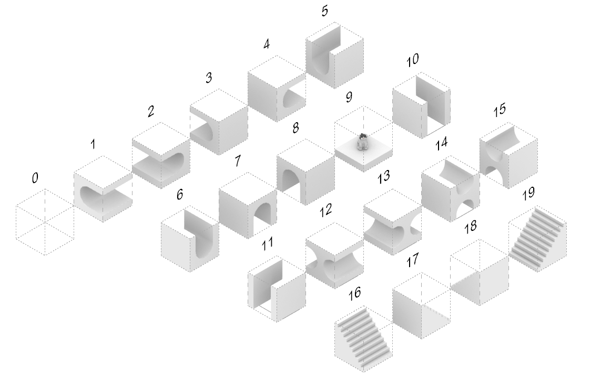

# Wave Function Collapse

<div align="justify">
  A 3D implementation of the Wave Function Collapse algorithm for generating modular cat-tower structures. The algorithm uses 20 predefined tiles (numbered 0-19), where each tile has interface labels (FREE, OPEN, CLOSED, SUPPORT, EMPTY) defined for its six faces (±x, ±y, ±z).
  <br><br>
  The algorithm initializes a 3D grid (width × depth × height) where each cell can be any of the 20 tiles. Starting from a seed position, it iteratively collapses cells by selecting the cell with the minimum number of possible tiles, then randomly samples a tile from the possibilities using weighted probabilities. After each collapse, constraints are propagated to neighboring cells using a BFS approach based on precomputed compatibility matrices. If a contradiction occurs (a cell has no valid tiles), the algorithm resets and restarts from the initial seed position. The process continues until all cells are collapsed to a single tile or the maximum iteration count is reached.
</div>

<br>

<div align="center" text-align="justify">
  　　
  
  <br><br>
  <p align="center">
    <i>
    Wave Function Collapse Process Visualization<br>
    </i>
  </p>
</div>

<br>

# Tileset

The tile set consists of 20 tiles (0-19), where each tile defines interface labels for its six faces. Compatibility is determined by the `_is_compatible` method:
- In x/y directions (±x, ±y): a **FREE** label is compatible with any other label
- In z direction (±z): two tiles are compatible only if their labels match
- In x/y directions for non-FREE labels: two tiles are compatible only if their labels match
- Tile 0 is the empty tile and can be weighted using the `empty_weight` parameter to adjust its selection probability

<br>
<div align="center">
  
  <br><br>
  <p align="center">
    <i>
    20 tiles with interface configurations for six directional faces
    </i>
  </p>
</div>

<br>

# Installation

This repository uses a Docker container configuration for development environment setup.

1. Ensure you have Docker and Visual Studio Code with the Remote - Containers extension installed.
2. Clone the repository.

    ```
    git clone https://github.com/<your-username>/wave-function-collapse.git
    ```

3. Open the project with VS Code.
4. When prompted at the bottom left in VS Code, click `Reopen in Container` or use the command palette (F1) and select `Remote-Containers: Reopen in Container`.
5. VS Code will build the Docker container and set up the environment. All required dependencies (torch, trimesh, tqdm, numpy) are automatically installed during the container build process.
6. Once the container is built and running, you're ready to start working with the project.


<br><br>


# File Details

### src
- `wfc.py`: Core implementation of the WaveFunctionCollapse class, including constraint computation, propagation algorithms, and 3D model building utilities
- `main.py`: Entry point for generating multiple cat-tower configurations with random parameters

### tiles
- Directory containing 20 predefined 3D tile models (1.obj through 19.obj) with corresponding material files (.mtl)
- Each tile represents a modular component with specific interface configurations (FREE, OPEN, CLOSED, SUPPORT, EMPTY) on its six faces

### assets
- `tiles.png`: Visual reference showing all available tile types and their interface configurations
- `animation-0.gif`, `animation-1.gif`: Animated visualizations of the wave function collapse process

<br><br>


# Usage

The main script generates multiple cat-tower configurations with randomized parameters. You can customize the generation by modifying the parameters in `wfc/src/main.py`.

```
cd wfc/src && python main.py
```

The script will:
1. Create an output directory structure under `wfc/output/`
2. Generate the specified number of results (default: 3)
3. Save intermediate build snapshots for each iteration if `intermediate_build=True`
4. Export the final result as a `.obj` file for each generation
